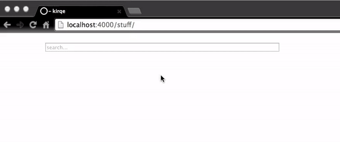

# vjsc

Title based posts search component for jekyll built with vuejs.



Add the following html to your page

```html
<div id="search">
  <search></search>
<div>
```

Include the following scripts at the bottom of your layout file.
After them include `search.js`

```html
<script src="https://code.jquery.com/jquery-3.2.1.min.js"></script>
<script src="https://cdnjs.cloudflare.com/ajax/libs/underscore.js/1.8.3/underscore-min.js"></script>
<script src="https://cdnjs.cloudflare.com/ajax/libs/vue/2.2.6/vue.min.js"></script>
```


Then add `post.json` to the root of your project
